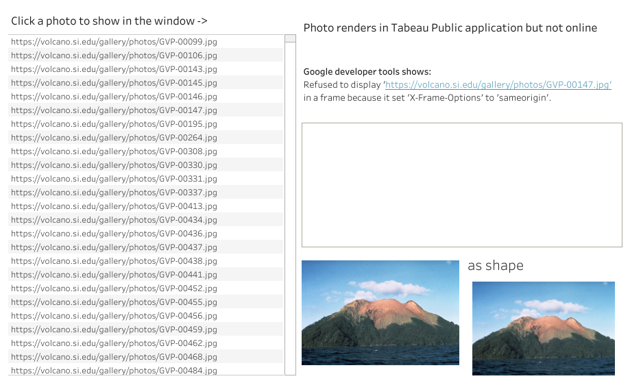

<h1 style="font-weight:normal">
  Viz2educate Geography :earth_africa:
</h1>

   

A repo for testing and building a dataset for a viz2educate project on geography.

[Twitter][Twitter] :speech_balloon:&nbsp;&nbsp;&nbsp;|&nbsp;&nbsp;&nbsp;[LinkedIn][LinkedIn] :necktie:&nbsp;&nbsp;&nbsp;|&nbsp;&nbsp;&nbsp;[GitHub :octocat:][GitHub]&nbsp;&nbsp;&nbsp;|&nbsp;&nbsp;&nbsp;[Website][Website] :link:

<!--
Quick Link 
-->

[Twitter]:https://twitter.com/WJSutton12
[LinkedIn]:https://www.linkedin.com/in/will-sutton-14711627/
[GitHub]:https://github.com/wjsutton
[Website]:https://wjsutton.github.io/

### :a: About

Viz2educate focuses on creating a high-quality bank of educational resources for teachers worldwide. Teachers will have free access to dig into subject-related visualizations.

Our Goal:

Use Social Media and Data Visualization to:

- Create an online gallery of educational resources for teachers and students globally.
- Create visualizations that do not only help teachers with access to unlimited resources, but also instigate the next generation toward data visualization.
- Our gallery will be a one-stop-shop for subjects like geography, history, science, etc. The visualizations will be based on a curated global syllabus post discussion with teachers from around the globe.

[Find out more about viz2educate here.](https://viz2educate.com/)

This month's theme is Geography, and from reviewing the [AQA Geography Specification](https://filestore.aqa.org.uk/resources/geography/specifications/AQA-8035-SP-2016.PDF) I've come up with three dataviz ideas to test:

- Volcanoes, Data from Smithsonian Institution [https://volcano.si.edu/database/webservices.cfm](https://volcano.si.edu/database/webservices.cfm)
- Deforestation, Data from Global Forest Watch [https://data.globalforestwatch.org/](https://data.globalforestwatch.org/)
- Earthquakes, Data from IRIS [http://ds.iris.edu/seismon/index.phtml](http://ds.iris.edu/seismon/index.phtml)

### :volcano: Volcanoes

Parsing XML from from Smithsonian Institution [https://volcano.si.edu/database/webservices.cfm](https://volcano.si.edu/database/webservices.cfm) provides outputs of:
- [Volcano locations](/data/volcano_locations.csv)
- [Volcano eruptions](/data/volcano_eruptions.csv)

The data is extracted using an [R Script](volcanoes_initial_workings.R) that ultises two XML libraries (XML,xml2) to read the XML, parse the XML and convert the XML to a dataframe.

There are three different calls available:
- Holocene_Volcanoes
- Pleistocene_Volcanoes
- Holocene_Eruptions

Calls for Holocene_Volcanoes & Pleistocene_Volcanoes together form the [Volcano locations](/data/volcano_locations.csv) dataset, and Holocene_Eruptions results in the [Volcano eruptions](/data/volcano_eruptions.csv) dataset.

Note the Smithsonian data includes photos of volcanoes, however linking these images as a webpage on Tableau Public causes them not to render, it is a known issue. One workaround is to import the image as a shape.

Demo:

### :deciduous_tree: Deforestation

Data from Global Forest Watch [https://data.globalforestwatch.org/](https://data.globalforestwatch.org/) comes suitable for [ArcGIS](https://www.arcgis.com/index.html) as a .tif file, showing images of the Earth's surface forest cover. 

As I have currently limited knowledge of ArcGIS and a deadline to meet with this project I have discontinued any efforts with this dataset for the time being.

### :earth_africa: Earthquakes

Data from IRIS [http://ds.iris.edu/seismon/index.phtml](http://ds.iris.edu/seismon/index.phtml) revealed another map service: [http://ds.iris.edu/ieb/index.html?format=text&nodata=404&starttime=1970-01-01&endtime=2025-01-01&minmag=5&maxmag=10&mindepth=0&maxdepth=900&orderby=time-desc&src=iris&limit=1000&maxlat=86.20&minlat=-86.20&maxlon=180.00&minlon=-180.00&pbl=1&caller=smevlnk&evid=11336206&zm=2&mt=sat](http://ds.iris.edu/ieb/index.html?format=text&nodata=404&starttime=1970-01-01&endtime=2025-01-01&minmag=5&maxmag=10&mindepth=0&maxdepth=900&orderby=time-desc&src=iris&limit=1000&maxlat=86.20&minlat=-86.20&maxlon=180.00&minlon=-180.00&pbl=1&caller=smevlnk&evid=11336206&zm=2&mt=sat) 

Which can be viewed as a table, e.g. [http://ds.iris.edu/ieb/evtable.phtml?caller=IEB&st=1970-01-01&et=2000-01-01&minmag=5&maxmag=10&mindepth=0&xde=900&orderby=time-desc&src=iris&limit=1000&maxlat=74.13&minlat=-69.02&maxlon=180.00&minlon=-180.00&caller=smevlnk&evid=11336206&zm=2&mt=sat&title=IEB%20export%3A%202500%20earthquakes%20as%20a%20sortable%20table.&stitle=from%20the%20earliest%20to%202000-01-01%2C%20with%20magnitudes%20from%205%20to%2010%2C%20depths%20from%200%20to%20900%20km%2C%20with%20priority%20for%20most%20recent%2C%20limited%20to%202500%2C%20%20showing%20data%20from%20IRIS%2C%20](http://ds.iris.edu/ieb/evtable.phtml?caller=IEB&st=1970-01-01&et=2000-01-01&minmag=5&maxmag=10&mindepth=0&xde=900&orderby=time-desc&src=iris&limit=1000&maxlat=74.13&minlat=-69.02&maxlon=180.00&minlon=-180.00&caller=smevlnk&evid=11336206&zm=2&mt=sat&title=IEB%20export%3A%202500%20earthquakes%20as%20a%20sortable%20table.&stitle=from%20the%20earliest%20to%202000-01-01%2C%20with%20magnitudes%20from%205%20to%2010%2C%20depths%20from%200%20to%20900%20km%2C%20with%20priority%20for%20most%20recent%2C%20limited%20to%202500%2C%20%20showing%20data%20from%20IRIS%2C%20)

From the map view I saw the total global earthquakes since 1970 was over 6 million, which may lead to performance issues in Tableau. So I have opted for earthquakes which have a magnitude of 5 or more, which is less than 90,000 data points.

In the [R Script](earthquakes_initial_workings.R) we can call the table and edit the parameters, the below will return 1,000 of the most recent earthquakes of 5+ magnitude from 2000-01-01 to 1970-01-01.

[http://ds.iris.edu/ieb/evtable.phtml?caller=IEB&st=1970-01-01&et=2000-01-01&minmag=5&maxmag=10&mindepth=0&xde=900&orderby=time-desc&src=iris&limit=1000&maxlat=90.00&minlat=-90.00&maxlon=180.00&minlon=-180.00&caller=smevlnk&evid=11336206&zm=2&mt=sat&title=IEB%20export%3A%2025000%20earthquakes%20as%20a%20sortable%20table.&stitle=from%20the%20earliest%20to%202000-01-01%2C%20with%20magnitudes%20from%205%20to%2010%2C%20depths%20from%200%20to%20900%20km%2C%20with%20priority%20for%20most%20recent%2C%20limited%20to%2025000%2C%20%20showing%20data%20from%20IRIS%2C%20](http://ds.iris.edu/ieb/evtable.phtml?caller=IEB&st=1970-01-01&et=2000-01-01&minmag=5&maxmag=10&mindepth=0&xde=900&orderby=time-desc&src=iris&limit=1000&maxlat=90.00&minlat=-90.00&maxlon=180.00&minlon=-180.00&caller=smevlnk&evid=11336206&zm=2&mt=sat&title=IEB%20export%3A%2025000%20earthquakes%20as%20a%20sortable%20table.&stitle=from%20the%20earliest%20to%202000-01-01%2C%20with%20magnitudes%20from%205%20to%2010%2C%20depths%20from%200%20to%20900%20km%2C%20with%20priority%20for%20most%20recent%2C%20limited%20to%2025000%2C%20%20showing%20data%20from%20IRIS%2C%20)

From this we can use the XML library to read the HTML, parse the HTML, and then read the table into a dataframe. As we are pulling 90,000 records over the web I've opted to pull the data in 5 year intervals leaving a 2 minute wait between calls, this is to not overwhelm IRIS and get my IP address blocked from accessing the site.

This then produces the [Earthquakes Magnitude 5-10](/data/earthquakes_mag_5_to_10.csv) dataset.

### 📈 Final Datavizs

Volcanoes 

